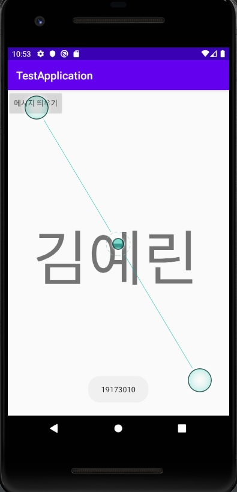
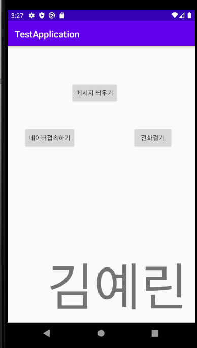
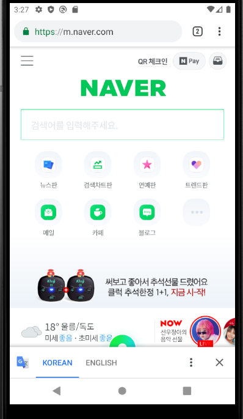
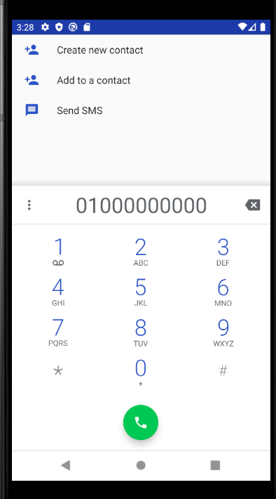

## 2주차 과제

Hello bello

## 3주차 과제

## 4주차 과제

 -펜팔 어플리케이션:
 
 각 나라의 친구들을 둘러볼 수 있게 해주고, 각자 자신의 소개글을 씀으로써 서로의 정보를 확인한다.(단 프로필 사진 대신 캐릭터로)
 사진 공유나 영상 공유, 혹은 영상통화 기능은 서로의 승인에 대해서만 가능하게 추가한다.
 편지를 쓰면 일반적인 메시지 어플처럼 바로 확인 가능하고, 읽었는지 등의 여부를 확인 할 수 있다.
 차단이나 신고 기능도 부가한다. 자신이 관심 있는 주제나 사용할 수 있는 언어에 대해서도 체크하여 프로필에 뜰 수 있게 만든다.
